```r
# reading libaries
library(tidyverse) # for read-csv (not necessary, but it's what I like to use)
```

```
## ── Attaching core tidyverse packages ──────────────────────── tidyverse 2.0.0 ──
## ✔ dplyr     1.1.4     ✔ readr     2.1.5
## ✔ forcats   1.0.0     ✔ stringr   1.5.1
## ✔ ggplot2   3.5.1     ✔ tibble    3.2.1
## ✔ lubridate 1.9.3     ✔ tidyr     1.3.1
## ✔ purrr     1.0.2     
## ── Conflicts ────────────────────────────────────────── tidyverse_conflicts() ──
## ✖ dplyr::filter() masks stats::filter()
## ✖ dplyr::lag()    masks stats::lag()
## ℹ Use the conflicted package (<http://conflicted.r-lib.org/>) to force all conflicts to become errors
```

```r
library(ModelMetrics)
```

```
## 
## Attaching package: 'ModelMetrics'
## 
## The following object is masked from 'package:base':
## 
##     kappa
```


```r
# reading data
# note: data was obtained through a given docx, which I made into a google doc, then copy pasted to google sheets, then saved as a csv
# note: the data we were given is about 10% of the data they used, so our graphs will look slightly different
metasequoia <- read_csv("data/metasequoia_data.csv")
```

```
## Rows: 500 Columns: 3
## ── Column specification ────────────────────────────────────────────────────────
## Delimiter: ","
## dbl (3): tree_number, diameter, height
## 
## ℹ Use `spec()` to retrieve the full column specification for this data.
## ℹ Specify the column types or set `show_col_types = FALSE` to quiet this message.
```

```r
# data exploration
metasequoia %>%
  pivot_longer(col = c("height", "diameter"),
               names_to = "datatype",
               values_to = "values") %>%
  group_by(datatype) %>%
  summarise(mean = mean(values),
            max = max(values),
            min = min(values),
            sd = sd(values)) %>%
  t()
```

```
##          [,1]       [,2]      
## datatype "diameter" "height"  
## mean     "53.36036" "26.69130"
## max      "134.68"   " 45.62"  
## min      "26.35"    "17.35"   
## sd       "13.33801" " 4.44614"
```


```r
# models
metasequoia_model1 <- lm(height ~ diameter, data = metasequoia)
metasequoia_model2 <- lm(height ~ I(log(diameter)), data = metasequoia)
metasequoia_model3 <- lm(height ~ diameter + I(diameter^2), data = metasequoia)
metasequoia_model4 <- lm(height ~ I(diameter^2) + I(diameter^3), data = metasequoia)
metasequoia_model5 <- lm(height ~ I(diameter^-1) + I(diameter^2), data = metasequoia)
# about non-linear models: not sure how to do it and this code is broken
# metasequoia_model8 <- nls(height ~ 1.3 + a1 * (1 - exp(-a1 * diameter))^a2, data = metasequoia, start = list(a1 = 1, a2 = 1))
```

Model 1: $Y = 10.1942 + 0.3092x$
Model 2: $Y = -39.31 + 16.72log(x)$
Model 3: $Y = 7.4610696 + 0.4066729 - 0.0008166x^2$
Model 4: $Y = 15.75 + 0.005308x^2 + 0.00002802x^3$
Model 5: $Y = 30.73 - 411.7x^{-1} + 0.001373x^2$


```r
# Fig 2. Scatter diagram of the tree height and dbh of a single Metasequoia tree.
plot(height ~ diameter, data = metasequoia, main = "Scatterplot of Height and Diameter", xlab = "Diameter (at breast height in cm)", ylab = "Height (in meters)")
abline(a = 12.546, b = 0.264) # the paper's data's trendline
abline(metasequoia_model1, col = "red") # trendline for model 1
```

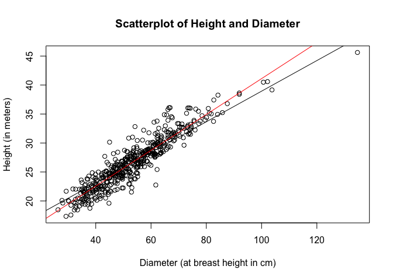<!-- -->


```r
#par(mfrow = c(2, 3))
# making residuals plot for model 1
plot(resid(metasequoia_model1) ~ predict(metasequoia_model1), main = "Residual Plot for Model 1", xlab = "Predicted Values", ylab = "Residuals")
abline(h = 0,col = "red",lty = 2)
```

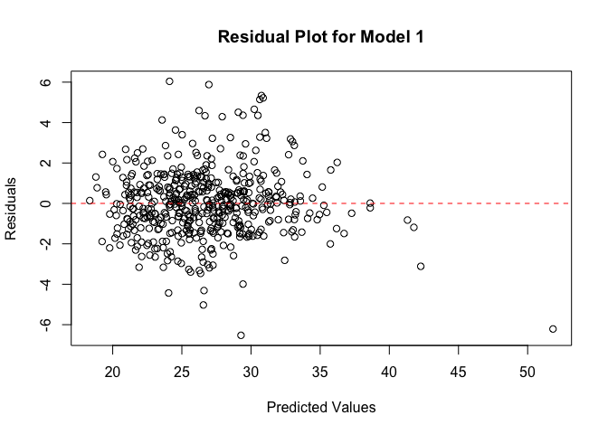<!-- -->

```r
# making residuals plot for model 2
plot(resid(metasequoia_model2) ~ predict(metasequoia_model2), main = "Residual Plot for Model 2", xlab = "Predicted Values", ylab = "Residuals")
abline(h = 0,col = "red",lty = 2)
```

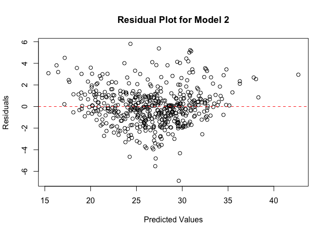<!-- -->

```r
# making residuals plot for model 3
plot(resid(metasequoia_model3) ~ predict(metasequoia_model3), main = "Residual Plot for Model 3", xlab = "Predicted Values", ylab = "Residuals")
abline(h = 0,col = "red",lty = 2)
```

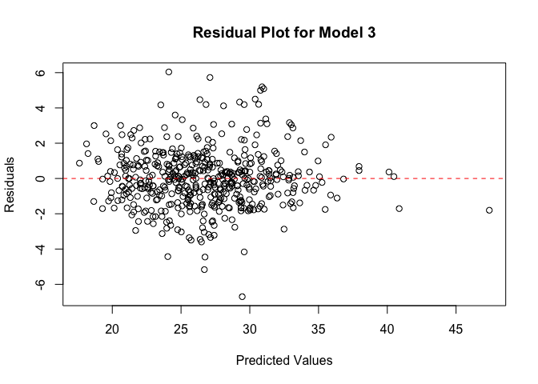<!-- -->

```r
# making residuals plot for model 4
plot(resid(metasequoia_model4) ~ predict(metasequoia_model4), main = "Residual Plot for Model 4", xlab = "Predicted Values", ylab = "Residuals")
abline(h = 0,col = "red",lty = 2)
```

<!-- -->

```r
# making residuals plot for model 5
plot(resid(metasequoia_model5) ~ predict(metasequoia_model5), main = "Residual Plot for Model 5", xlab = "Predicted Values", ylab = "Residuals")
abline(h = 0,col = "red",lty = 2)
```

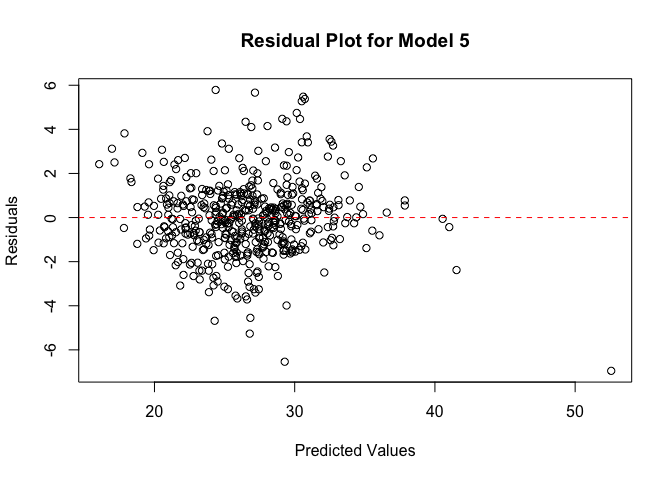<!-- -->


```r
#par(mfrow = c(2, 3))
# making qq plot for model 1
qqnorm(resid(metasequoia_model1), main = "Q-Q Plot for Model 1", col = "red")
qqline(resid(metasequoia_model1))
```

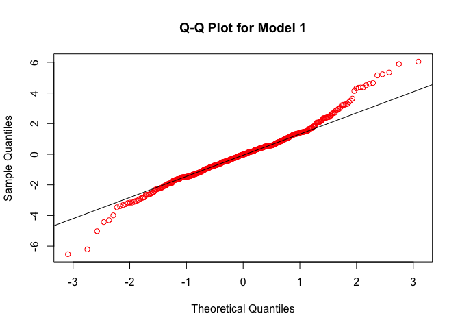<!-- -->

```r
# making qq plot for model 2
qqnorm(resid(metasequoia_model2), main = "Q-Q Plot for Model 2", col = "red")
qqline(resid(metasequoia_model2))
```

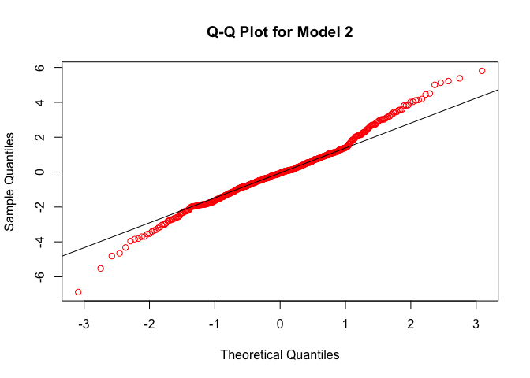<!-- -->

```r
# making qq plot for model 3
qqnorm(resid(metasequoia_model3), main = "Q-Q Plot for Model 3", col = "red")
qqline(resid(metasequoia_model3))
```

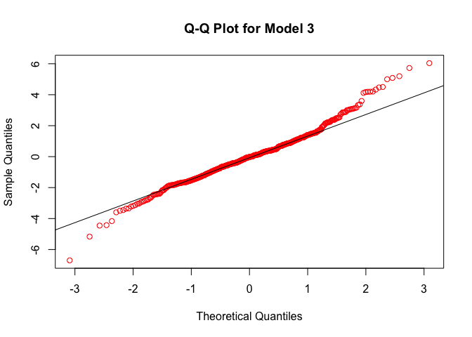<!-- -->

```r
# making qq plot for model 4
qqnorm(resid(metasequoia_model4), main = "Q-Q Plot for Model 4", col = "red")
qqline(resid(metasequoia_model4))
```

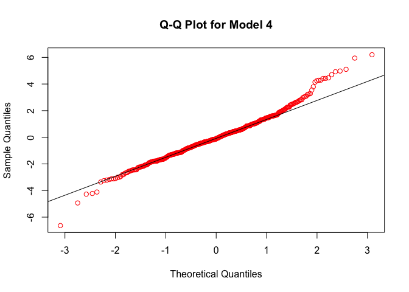<!-- -->

```r
# making qq plot for model 5
qqnorm(resid(metasequoia_model5), main = "Q-Q Plot for Model 5", col = "red")
qqline(resid(metasequoia_model5))
```

<!-- -->


```r
#par(mfrow = c(2, 3))
# predicted vs observed for model 1
plot(height ~ predict(metasequoia_model1), data = metasequoia, main = "Observed vs Predicted in Model 1", xlab = "Predicted", ylab = "Observed")
abline(a = 0, b = 1, col = "red")
```

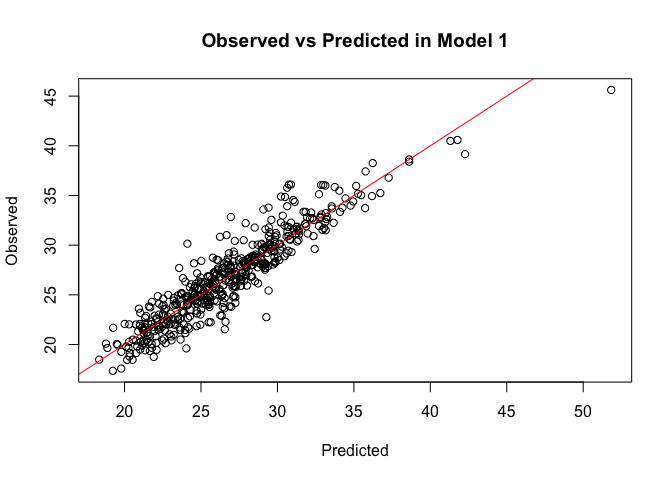<!-- -->

```r
# predicted vs observed for model 2
plot(height ~ predict(metasequoia_model2), data = metasequoia, main = "Observed vs Predicted in Model 2", xlab = "Predicted", ylab = "Observed")
abline(a = 0, b = 1, col = "red")
```

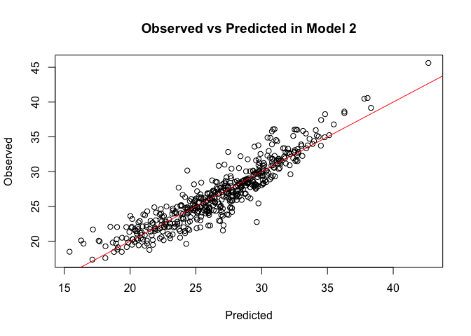<!-- -->

```r
# predicted vs observed for model 3
plot(height ~ predict(metasequoia_model3), data = metasequoia, main = "Observed vs Predicted in Model 3", xlab = "Predicted", ylab = "Observed")
abline(a = 0, b = 1, col = "red")
```

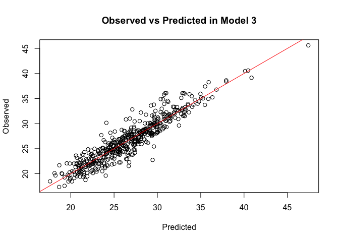<!-- -->

```r
# predicted vs observed for model 4
plot(height ~ predict(metasequoia_model4), data = metasequoia, main = "Observed vs Predicted in Model 4", xlab = "Predicted", ylab = "Observed")
abline(a = 0, b = 1, col = "red")
```

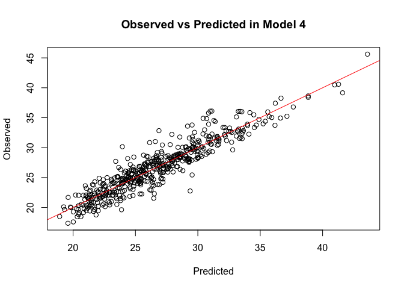<!-- -->

```r
# predicted vs observed for model 5
plot(height ~ predict(metasequoia_model5), data = metasequoia, main = "Observed vs Predicted in Model 5", xlab = "Predicted", ylab = "Observed")
abline(a = 0, b = 1, col = "red")
```

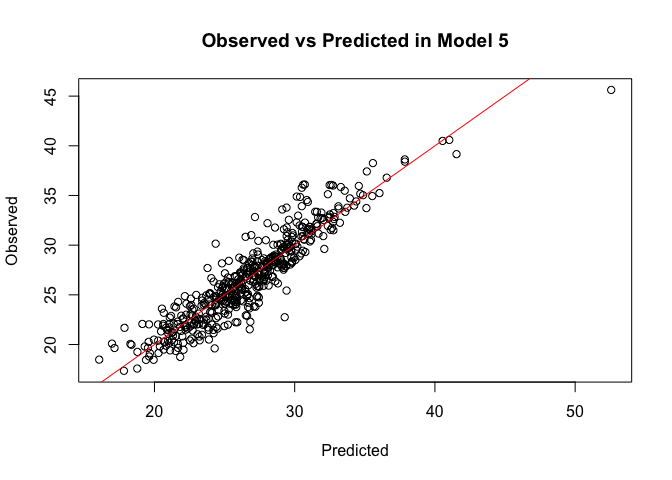<!-- -->


```r
# calculating bias
mean((predict(metasequoia_model1) - metasequoia$height) / metasequoia$height) * 100
```

```
## [1] 0.419971
```

```r
mean((predict(metasequoia_model2) - metasequoia$height) / metasequoia$height) * 100
```

```
## [1] 0.3725447
```

```r
mean((predict(metasequoia_model3) - metasequoia$height) / metasequoia$height) * 100
```

```
## [1] 0.379749
```

```r
mean((predict(metasequoia_model4) - metasequoia$height) / metasequoia$height) * 100
```

```
## [1] 0.3978608
```

```r
mean((predict(metasequoia_model5) - metasequoia$height) / metasequoia$height) * 100
```

```
## [1] 0.4128386
```


```r
# calculating RMSE
# we want the lowest value which is model 4
rmse(metasequoia_model1) # can also use: rmse(metasequoia$height, predict(metasequoia_model1))
```

```
## [1] 1.66083
```

```r
rmse(metasequoia_model2)
```

```
## [1] 1.739887
```

```r
rmse(metasequoia_model3)
```

```
## [1] 1.635669
```

```r
rmse(metasequoia_model4)
```

```
## [1] 1.631005
```

```r
rmse(metasequoia_model5)
```

```
## [1] 1.70729
```


```r
# calculating AIC
# we want the lowest value which is model 4
AIC(metasequoia_model1)
```

```
## [1] 1932.256
```

```r
AIC(metasequoia_model2)
```

```
## [1] 1978.759
```

```r
AIC(metasequoia_model3)
```

```
## [1] 1918.99
```

```r
AIC(metasequoia_model4)
```

```
## [1] 1916.135
```

```r
AIC(metasequoia_model5)
```

```
## [1] 1961.846
```


```r
# calculating R^2adj
# we want the highest value which is model 4
summary(metasequoia_model1)$adj.r.squared
```

```
## [1] 0.8599043
```

```r
summary(metasequoia_model2)$adj.r.squared
```

```
## [1] 0.8462496
```

```r
summary(metasequoia_model3)$adj.r.squared
```

```
## [1] 0.8638436
```

```r
summary(metasequoia_model4)$adj.r.squared
```

```
## [1] 0.8646189
```

```r
summary(metasequoia_model5)$adj.r.squared
```

```
## [1] 0.8516588
```


```r
# calculating CIs
confint(metasequoia_model1, level = 1-0.05)
```

```
##                 2.5 %     97.5 %
## (Intercept) 9.5906813 10.7977800
## diameter    0.2981895  0.3201372
```

```r
confint(metasequoia_model2, level = 1-0.05)
```

```
##                      2.5 %    97.5 %
## (Intercept)      -41.78667 -36.82948
## I(log(diameter))  16.09408  17.34758
```

```r
confint(metasequoia_model3, level = 1-0.05)
```

```
##                      2.5 %       97.5 %
## (Intercept)    5.969239960  8.952899316
## diameter       0.356681537  0.456664165
## I(diameter^2) -0.001225269 -0.000407843
```

```r
confint(metasequoia_model4, level = 1-0.05)
```

```
##                       2.5 %        97.5 %
## (Intercept)    1.521801e+01  1.628303e+01
## I(diameter^2)  4.946444e-03  5.670146e-03
## I(diameter^3) -3.143211e-05 -2.460142e-05
```

```r
confint(metasequoia_model5, level = 1-0.05)
```

```
##                        2.5 %        97.5 %
## (Intercept)     2.909117e+01  3.236874e+01
## I(diameter^-1) -4.698412e+02 -3.535830e+02
## I(diameter^2)   1.197215e-03  1.548137e-03
```

